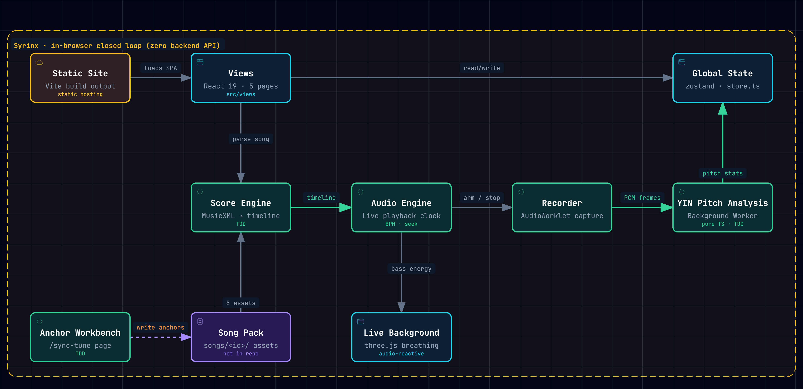

<div align="center">


# Syrinx · Flowing Flute

**Keep your music close. Make room for a calmer practice.**

Personal music library · Sheet music reader · Flute practice with accompaniment

[中文](README.md) · [Try online](https://romanticjojo.com) · [Quick start](#quick-start) · [Release notes](https://github.com/Romanticjojo/Syrinx/blob/dev/docs/releases/v0.3.0.md)


[](LICENSE)

</div>

> This repository ships the complete v0.3.0 source and song assets, with Windows installers on [Releases](https://github.com/Romanticjojo/Syrinx/releases).

## Download the Windows installer

| Entry | What you get |
| --- | --- |
| **GitHub Release** | [Download Syrinx v0.3.0 for Windows](https://github.com/Romanticjojo/Syrinx/releases/latest) — run `Syrinx-0.3.0-x64-setup.exe` for a one-click install; a portable `Syrinx-0.3.0-x64-portable.exe` is also available |
| Try online | [romanticjojo.com](https://romanticjojo.com) — the featured library, straight in your browser |
| From source | See [Quick start](#quick-start) below |

The installer ships with every featured song (score, accompaniment, cover and animated background video) — everything works offline after install. See [NOTICE.md](NOTICE.md) for asset notes.

> Unsigned installers from small projects may trigger browser or SmartScreen warnings: choose "Keep anyway" in the download bar, or "More info → Run anyway" on the SmartScreen dialog.

<p align="center">
  
  <br /><sub>Actual application screenshot · Desktop personal library · Original project studies shown</sub>
</p>

## A home for everyday practice

**Collect and organize.** Import MusicXML, XML or MXL, then add titles, composer / arranger details, tags and covers. Find your next piece with folders, favorites and search. Both card and list views support pagination.

**Open and read.** Browse, turn pages and zoom at desktop, tablet and phone widths. A flute-only score opens as sheet music without generating audio. Editing its information preserves the original imported score.

**Practice at your pace.** When the score contains piano, choose one existing piano part for locally synthesized accompaniment, including both staves of that part. Follow the score cursor, adjust BPM, start from a selected measure, then listen back and review pitch comparisons.

## Choose your edition

| | Full features · Run locally | Web demo |
|---|---|---|
| Purpose | Collect, read and practice with your own scores | Try the performance flow with featured pieces |
| Personal library | Import, edit information, covers, folders, favorites and backups | A tab marked “开发中” (In development) opens a brief notice |
| Music | Your imports; featured pieces depend on local assets | Six featured pieces: Luv Letter, Flower Dance, Lumière, Alicia, Interstellar, Weight of the World |
| Entry point | `dev` · `npm run dev` | [Try online](https://romanticjojo.com) · `npm run dev:web` |
| Version mapping | `dev` → `v0.3.0` | `web-deploy` → `v0.3.0-web` |

Both modes currently run in a browser. Native Windows, Android, macOS and iOS installers are planned. The online site runs its deployed build and may lag behind branch updates; pushing source code does not automatically deploy the site.

## Three steps to your next practice

### 1. Import a score

After starting locally, open “个人仓库” (Personal library), click “导入乐谱” (Import score) or drop a file, then confirm its title and parts. Start with either of the two original studies included in this repository:

| Example | Contents | Try it with |
|---|---|---|
| [Morning Light · 晨光练习](https://raw.githubusercontent.com/Romanticjojo/Syrinx/dev/docs/examples/morning-light.musicxml) | Flute + one piano part with two staves | “钢琴伴奏” (Piano accompaniment) for reading, listening and performing |
| [Breath Study · 长音与呼吸](https://raw.githubusercontent.com/Romanticjojo/Syrinx/dev/docs/examples/breath-study.musicxml) | Solo flute | “仅阅谱” (Read only) |

Save the linked file with a `.musicxml` extension and import it, or find it in `docs/examples/` after cloning. [About the examples](docs/examples/README.md)

### 2. Make the library yours

Use a score's menu to edit its title, author, tags and PNG / JPEG / WebP cover. Create folders, move multiple scores, or favorite pieces you practice often. Removing a folder returns its scores to “未分类” (Unfiled).

<table>
  <tr>
    <td width="76%"></td>
    <td width="24%"></td>
  </tr>
  <tr>
    <td align="center"><sub>A list for finding the next piece</sub></td>
    <td align="center"><sub>A bookshelf for smaller screens</sub></td>
  </tr>
</table>

### 3. Open your music and practice

Melody-only scores are ready for page-by-page reading. For a score with an existing piano part, preview the accompaniment and choose “开始演奏” (Start performing). A four-beat count-in leads into accompaniment and a moving score cursor.

A first-use hint introduces measure selection and BPM; dismissing it or starting playback saves that choice. Click a measure to choose a starting point, or use the BPM control to slow down. The selection box disappears after that measure has played. Seeking or applying a new tempo during performance saves the current recording segment, then starts a new one after four count-in beats. These actions leave ready or paused sessions stopped.

<p align="center">
  
  <br /><sub>Actual application screenshot · Adjusting practice tempo with the original Morning Light score</sub>
</p>

| To… | Use… |
|---|---|
| Start / pause / resume | The play control or Space |
| Start from a measure | Click that measure; seeking during playback triggers a new count-in |
| Change tempo | Open BPM, type a value or move the slider, then choose “应用速度” (Apply tempo) |
| Restore the score's suggested tempo | “还原推荐” (Restore recommended) in the tempo panel |
| Record and listen back | Enable recording; after finishing, select a segment and replay it with optional accompaniment |
| Adjust the score size | Zoom controls; the personal reader also provides previous / next page buttons |

Tempo spans **0.5–1.5×** the score's initial tempo, keeping written tempo changes in proportion. Speed changes use the browser's pitch-preservation support. Each recording segment retains its practice speed so replay and pitch analysis align with the corresponding score interval. Recording needs microphone permission; headphones help keep accompaniment out of the recording.

## Featured songs: an immersive performance flow

Alongside the personal library, Syrinx ships a featured-song performance line built for the **online demo**: hero carousel → song preview → perform → recording playback with pitch feedback. No account, no importing.

<p align="center">
  
  <br /><sub>The hero carousel rotates featured songs; hovering a cover starts its animated cover video</sub>
</p>

### The catalog

Six piano-accompanied pieces are featured — Luv Letter, Flower Dance, Lumière, Alicia, Interstellar and Weight of the World. Each ships with a real-sampled piano accompaniment (Salamander Grand V3), a flute part aligned note-for-note with the accompaniment, a cover and a looping background video.

- Library cards play a square animated cover on hover; entering a song swaps the background to its HD loop.
- Performance backgrounds use **fixed-camera, cover-sourced** motion with a pad color sampled from the video's first frame, so the scene blends seamlessly with the cover.

<table>
  <tr>
    <td width="50%"></td>
    <td width="50%"></td>
  </tr>
  <tr>
    <td align="center"><sub>Catalog: hover a card to play its animated cover</sub></td>
    <td align="center"><sub>Preview: read the score and listen before performing</sub></td>
  </tr>
</table>

### Performing, with live feedback

On the perform page, choose “开始演奏” (Start performing). After a four-beat count-in, accompaniment and score cursor advance together:

| Feedback | What you get |
|---|---|
| Score cursor | Follows the live accompaniment position; auto-scrolls to keep the current line centered, yields to manual scrolling |
| Measure HUD | Top-right live measure and elapsed time, e.g. `01 / 97` |
| Live pitch | Real-time intonation while you play — drift is visible the moment it happens |

<p align="center">
  
  <br /><sub>Mid-performance: the background video comes from the song cover; the cursor tracks the accompaniment note by note</sub>
</p>

### Playback and pitch analysis

When a take ends, the playback page opens. Recording and accompaniment have separate volume sliders for A/B listening:

| Legend | Meaning |
|---|---|
| Bold highlighted trace | Hit notes (intonation within tolerance) |
| Thin red trace | Off-pitch notes (cents deviation beyond tolerance) |
| Hatched blocks | Missed notes (no pitch detected in that window) |

The pitch chart's x-axis is score time, with target notes and your measured trace overlaid — hits, drifts and missed notes at a glance. Summary cards report overall in-tune ratio and average cents deviation. Pitch analysis runs in a background Worker, so long pieces never block the UI.

<p align="center">
  
  <br /><sub>Playback: dual sliders for recording and accompaniment; the pitch chart compares note by note against score targets</sub>
</p>

### The same immersion on mobile

The performance flow adapts to touch layouts: floating pitch meter, line-following score and background video identical to desktop.

<p align="center">
  
</p>

> Featured-song assets (scores, accompaniments, covers and videos) are distributed with this repository — see [NOTICE.md](NOTICE.md). Run `npm run dev:web` after cloning for the full flow, or grab the Windows installer from [Releases](https://github.com/Romanticjojo/Syrinx/releases).

## Quick start

You need **Node.js 20.19+ or 22.12+** and npm. Run:

```bash
git clone https://github.com/Romanticjojo/Syrinx.git
cd Syrinx/app
npm install
npm run dev
```

Open the local address printed in the terminal, usually `http://localhost:5173`. This command enables the personal library; `desktop` is the current name of this feature mode.

```bash
npm run dev:web        # Web demo mode
npm run build          # Web demo build → app/dist
npm run build:desktop  # Full-feature build → app/dist-desktop
npm run preview        # Preview the default app/dist build
```

The repository includes a four-measure public fallback sample, the two importable studies above, and every featured song's assets (`app/public/songs/`) — a fresh clone works out of the box.

## Your data stays on your device

The personal library needs no account. Import parsing, cover processing and synthesis of the original piano part happen locally. Scores, edited information, covers and folders live in the current browser's IndexedDB storage.

Different browsers, profiles and site addresses have separate libraries. Changing a domain or local port does not migrate your data, and clearing site data deletes the library. **Export backups** regularly from the library menu and import them to restore or move your collection. Save and restore every part of a multi-file backup.

A locally running app can read imported scores and play their original piano accompaniment offline while its local server remains available. Website offline caching and cloud sync are not provided. Editing means changing score information; accompaniment uses one existing piano part. Note editing and automatic arrangement are outside the current feature set.

## Architecture and performance data flow

Syrinx is a statically hosted browser application. These Archify diagrams show the core path for featured pieces; every engine in the diagrams runs in the browser.

### Core architecture



[Interactive diagram source](docs/img/syrinx-architecture-en.html) · [Structured data](docs/img/syrinx-architecture-en.json)

### From a score to practice feedback


[Interactive diagram source](docs/img/syrinx-dataflow-en.html) · [Structured data](docs/img/syrinx-dataflow-en.json)

The live accompaniment position drives the score cursor. Seeking or changing tempo during playback saves the current take and counts in a new segment. Each segment retains its start and speed so replay and charts align with score time. Post-take pitch analysis runs in a background Worker to keep the interface responsive. The personal library separately uses IndexedDB for local score storage.

## Contributing

Syrinx uses React, TypeScript, Vite, OpenSheetMusicDisplay, Web Audio and three.js. Reading and performance run in the browser; the personal library and featured Song Packs are separate score sources.

```bash
cd app                # Skip if already in app
npm test              # Unit and component tests
npm run lint          # Static checks
npm run build
npm run build:desktop
```

- [v0.3.0 release notes](docs/releases/v0.3.0.md)
- [Issues and feedback](https://github.com/Romanticjojo/Syrinx/issues) · [Source code](app/src)

Next directions: native installers, measure-loop practice, and further reading and performance validation on physical devices.

## Acknowledgements and license

Thanks to [OpenSheetMusicDisplay](https://github.com/opensheetmusicdisplay/opensheetmusicdisplay), [three.js](https://github.com/mrdoob/three.js) and the wider open-source community. Syrinx uses the [Apache License 2.0](LICENSE). Song media belongs to its respective rights holders.
