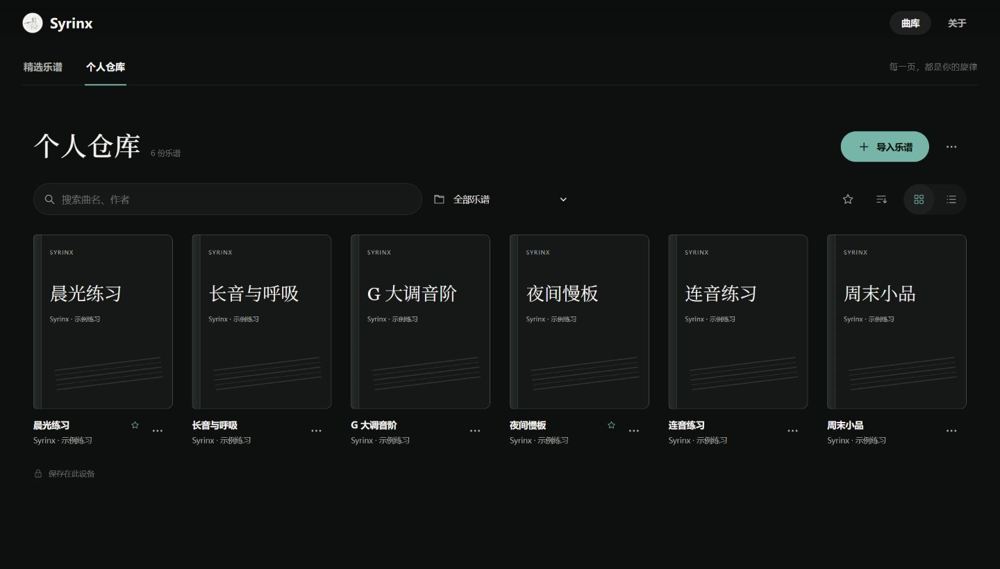
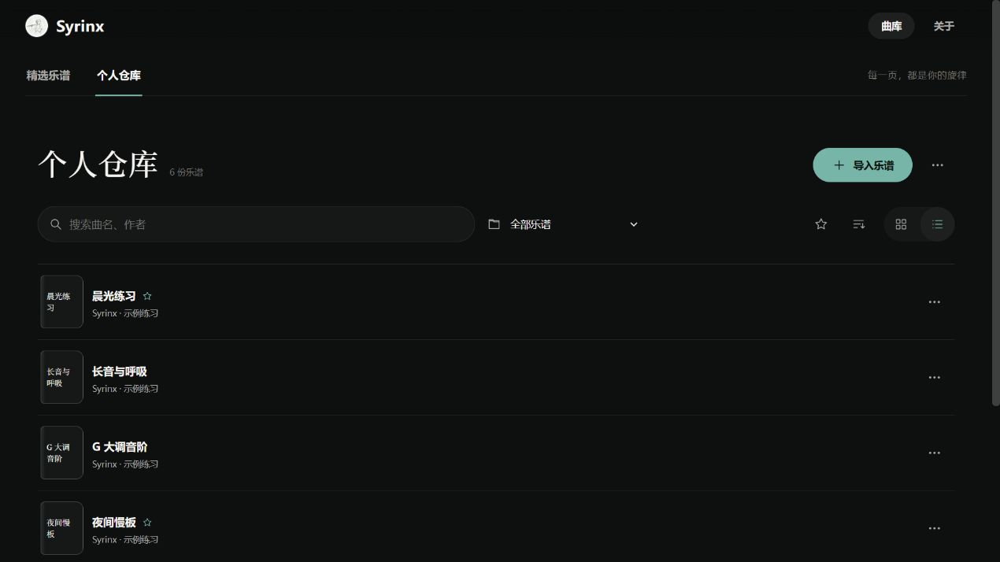
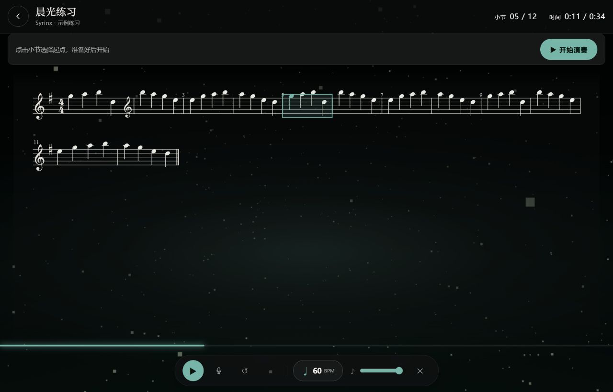

<div align="center">


# Syrinx · Flute Companion

**Keep the scores you love close at hand, and let every practice session begin with ease.**

Personal score library · Digital sheet-music reading · Flute practice with accompaniment

[中文](README.md) · [Try online](https://romanticjojo.com) · [Quick start](#quick-start)


[](LICENSE)

</div>

> **Note:** the application UI is currently in Chinese.

## Download & run

| Platform | File | Download |
|---|---|---|
| **Windows** | `Syrinx-0.3.0-x64-setup.exe` one-click install | [GitHub Release](https://github.com/Romanticjojo/Syrinx/releases/latest) · [Quark Drive](https://pan.quark.cn/s/36f12925b1cd) (fast in mainland China) |
| **Windows** | `Syrinx-0.3.0-portable.exe` portable build | [GitHub Release](https://github.com/Romanticjojo/Syrinx/releases/latest) |
| **macOS** (Apple Silicon) | `Syrinx-0.3.0-mac-arm64.dmg` | [GitHub Release](https://github.com/Romanticjojo/Syrinx/releases/latest) |
| Try online | no download | [romanticjojo.com](https://romanticjojo.com) |

The installers ship with all five featured songs (scores, sampled-piano accompaniments, covers and animated background videos) — **everything works offline after install**. Unsigned installers may trigger a SmartScreen prompt: choose "More info → Run anyway". On macOS, Gatekeeper may block the first launch: in Finder → Applications, **right-click Syrinx → Open**, then click "Open" (only needed once). Intel Macs should run from source.

**Other platforms / from source** — see [Quick start](#quick-start) below.

Asset provenance and copyright notes live in [NOTICE.md](NOTICE.md).

<p align="center">
  
  <br /><sub>Featured library home · hero carousel; hovering a card plays its animated cover</sub>
</p>

## What it does

**A library of your own.** Import MusicXML, XML or MXL; curate titles, composers, tags and covers with folders, favorites, search and pagination — all data stays on your device. See [Personal score library](#personal-score-library).

**Ready to practice.** Flute-only scores open directly for reading; scores with a piano part can synthesize the accompaniment locally — four-beat count-in, tap-to-position, 0.5–1.5× pitch-preserved tempo, then review your take with per-note pitch analysis.

**A featured library, ready out of the box.** Five piano-accompanied pieces (Luv Letter, Flower Dance, Lumière, Alicia, Interstellar) ship with the repository and installer — no imports required. See [The immersive featured-song flow](#the-immersive-featured-song-flow).

## Personal score library

Import your own MusicXML / XML / MXL and get a shelf that travels with you — everything stored on your own device.

<p align="center">
  
  <br /><sub>Personal library · import and organize, card and list views</sub>
</p>

**Collect and organize.** Importing auto-detects the title, parts and time signature; afterwards edit details, set PNG / JPEG / WebP covers, group into folders, favorite often-practiced pieces, and search by title or composer.

**Open and practice.** Flute-only scores read page by page; scores with a piano part offer locally synthesized "original-score piano" — audition it, then hit "开始演奏" (start performing) with count-in, tap-to-position and 0.5–1.5× pitch-preserved tempo control.

<table>
  <tr>
    <td width="50%"></td>
    <td width="50%"></td>
  </tr>
  <tr>
    <td align="center"><sub>List view, for quick lookup</sub></td>
    <td align="center"><sub>Scores with a piano part: audition, then perform</sub></td>
  </tr>
</table>

Two original études ship with the repository (`docs/examples/`: Morning Light and Breath Study) to import and try; export a backup anytime from the library menu.

## The immersive featured-song flow

Hero carousel → preview → perform → playback with pitch feedback, no account needed.

### Library & preview

Hovering a library card plays its square animated cover; opening a song switches the background to a high-definition looping video sourced from the same artwork, with the perform page's backdrop color sampled from the video's first frame.

<table>
  <tr>
    <td width="50%"></td>
    <td width="50%"></td>
  </tr>
  <tr>
    <td align="center"><sub>Library: hover a card to play its animated cover</sub></td>
    <td align="center"><sub>Preview: read, listen, then perform</sub></td>
  </tr>
</table>

### Performing with live feedback

Hit "开始演奏" (start performing) and, after a four-beat count-in, the accompaniment and score cursor advance together:

- **Score cursor** — tracks the accompaniment in real time, auto-centers each line, and yields to manual scrolling
- **Measure HUD** — top-right live measure counter and elapsed time (e.g. `01 / 97`)
- **Live pitch** — your intonation status displays while you play; deviations are visible instantly

<p align="center">
  
  <br /><sub>Mid-performance: background video from the song artwork, cursor locked to the accompaniment note by note</sub>
</p>

### Playback & pitch analysis

When the take ends, the playback page opens with independent recording/accompaniment volume controls. On the pitch chart, bold highlighted traces are hit notes, thin red traces are off-pitch notes, and hatched blocks are misses; a stats card reports the overall in-tune ratio and average cent deviation. Analysis runs in a background Worker, so long pieces never freeze the UI.

<p align="center">
  
  <br /><sub>Playback: dual volume sliders, pitch chart aligned note by note against the score</sub>
</p>

## Quick start

You need **Node.js 20.19+ or 22.12+** and npm:

```bash
git clone https://github.com/Romanticjojo/Syrinx.git
cd Syrinx/app
npm install
npm run dev          # personal-library mode (full feature set)
```

Open the local address the terminal prints (usually `http://localhost:5173`). More commands:

```bash
npm run dev:web      # featured-library mode (same shape as the installer)
npm test             # unit and component tests
npm run build        # build → app/dist
npm run dist         # package the Windows installer (electron-builder)
npm run dist:mac     # package the macOS dmg/zip, Apple Silicon (M-series)
```

The repository bundles every featured song's assets (`app/public/songs/`) plus two importable original études (`docs/examples/`) — a fresh clone works out of the box.

## Your data stays on your device

The personal library needs no account. Importing, cover processing and piano synthesis all run locally; scores and edits live in the current browser's IndexedDB. Each browser/site pairing has its own library, and clearing site data deletes it — use the library menu's **export backup** regularly.

## Architecture & performance data flow

Syrinx is a statically deployed browser app: score parsing, timelines, the accompaniment engine and pitch analysis all run client-side.

| Diagram | Contents |
|---|---|
| [Core architecture](docs/img/syrinx-architecture-en.png) | Views, score, accompaniment, recording and pitch-analysis modules |
| [Performance data flow](docs/img/syrinx-dataflow-en.png) | Asset parsing → timeline → synchronized performance → take segmentation → pitch feedback |

The accompaniment's actual playback position drives the score cursor. Jumping measures or changing tempo saves the current take and starts a new segment with a count-in; each segment records its start point and tempo, and playback/charts align to the corresponding score time.

## Contributing

React 19 · TypeScript · Vite · OpenSheetMusicDisplay · Web Audio · three.js. The personal library and the featured Song Pack are two independent score sources.

```bash
cd app
npm test && npm run lint && npm run build
```

- [v0.3.0 release notes](docs/releases/v0.3.0.md)
- [Report an issue or suggest an improvement](https://github.com/Romanticjojo/Syrinx/issues)

## Acknowledgements & license

Thanks to [OpenSheetMusicDisplay](https://github.com/opensheetmusicdisplay/opensheetmusicdisplay), [three.js](https://github.com/mrdoob/three.js) and other open-source projects. Program code is licensed under [Apache License 2.0](LICENSE); song assets belong to their respective rights holders — see [NOTICE.md](NOTICE.md).
