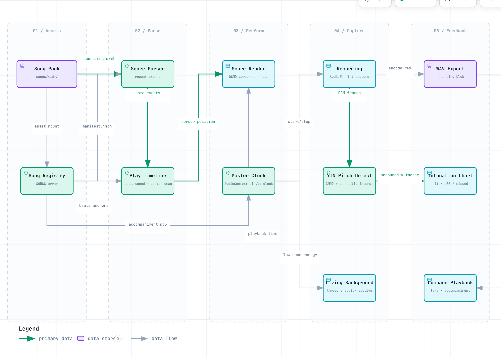

<div align="center">

<a href="README.md">中文</a>


# 🎶 Syrinx · Flowing Flute

**Play a real flute, and let the score flow with you.**

[中文](README.md) · [Quick Start](#-quick-start) · [Features](#-features) · [Roadmap](#-roadmap) · [FAQ](#-faq--known-issues)


*A flute performance companion between a "smart sheet-music player" and a music rhythm game.*

</div>

<p align="center">
  
</p>

## ✅ Features

The screen above is the first thing you see when opening Syrinx: the goddess-flute emblem and brand wordmark on a dark stage — click "Enter" to reach the library. From there, the core experience is a perform view where the top HUD shows measure and time in real time, a cursor advances note by note with the accompaniment across the score, a three.js living background breathes with the music, and the bottom control bar gathers pause / recording / zoom / exit in one place. Around this main loop, the subsystems offer:

| Status | Feature |
|:---:|---|
| ✅ | MusicXML score rendering (OpenSheetMusicDisplay), cursor tracking the accompaniment timeline note by note, auto-scrolling page turns |
| ✅ | Web Audio as the single master clock: score / audio / background three-way sync, perceptible error < 50ms |
| ✅ | Procedural accompaniment synthesis: when no accompaniment audio exists, an OfflineAudioContext synthesizes a nocturne-style backing |
| ✅ | In-house pure-TS **YIN pitch detection** (TDD), producing pitch-comparison curves and intonation statistics (±50 cents) after each performance |
| ✅ | Performance recording and playback, with the accompaniment playing alongside for comparison |
| ✅ | three.js dynamic immersive background; low-frequency energy drives glow and particle breathing (audio-reactive) |
| ✅ | 3D flute-model entrance animation + preview page, skippable |
| ✅ | Light & dark themes + per-song accent color (defined in the Song Pack) |
| ✅ | Vitest unit tests covering the score timeline / YIN / pitch statistics |
| ❌ | Mobile / PWA (planned) |
| ❌ | CREPE deep-learning pitch detection enhancement (planned) |
| ❌ | Loop-measure practice, tempo adjustment (planned) |

## ✨ Highlights

Beneath the feature table lie a few design decisions that run through the whole project — they define Syrinx's engineering character for the "live performance" scenario:

> 🎼 **Time is the score**
> `AudioContext.currentTime` is the single source of time → converted every frame by rAF → written straight to the DOM to drive the cursor, bypassing the reactive store to avoid re-render jitter.

> 🎹 **Accompaniment with zero assets**
> It runs without an mp3: the app procedurally synthesizes a nocturne-style accompaniment — "melody + bass pad + breath noise + reverb" — from MusicXML note events.

> 🎤 **Hear your intonation**
> An in-house YIN algorithm (difference function + cumulative mean normalized difference + parabolic interpolation), implemented in pure TypeScript with TDD all green and an interface-based design so it can be swapped for CREPE.

> 🌌 **Atmosphere while you play**
> A three.js dawn-light theme scene breathes with the music while the score area stays protected; controls fade away after 3.2 seconds of inactivity for immersive performance.

## 🚀 Quick Start

**Requirements**: Node.js **≥ 20.19** (or ≥ 22.12, required by Vite 8); npm ≥ 10.

```bash
git clone https://github.com/Romanticjojo/Syrinx.git
cd Syrinx/app
npm install

npm run dev        # Start the dev server → http://localhost:5173
npm run build      # Production build
npm run preview    # Preview the production build
```

After launching: entrance animation (skippable) → pick a song in the library → detail preview → **Start performing**:
4-beat count-in · Space to pause/resume · ⏺ recording toggle · zoom +/- · Esc to exit.

> ⚠️ **Song assets are not distributed with the repo**: the scores / accompaniments / covers under `app/public/songs/` (copyrighted media) are not included, so the library is empty after cloning. Add songs yourself following the [Song Pack](#-song-pack) spec below, or drop in any MusicXML file for a quick try.

> 🎧 Playing with headphones is recommended: speaker accompaniment will leak into the microphone recording.

## 📁 Project Structure

```
Syrinx/
├── app/                        # Frontend project (Vite + React + TS)
│   ├── public/
│   │   └── songs/              # Song assets (Song Pack, not committed)
│   ├── src/
│   │   ├── views/              # Views: Home / Preview / Perform / Result / SyncTune
│   │   ├── score/              # MusicXML → timeline parsing (TDD), OSMD wrapper
│   │   ├── audio/              # Master clock engine, accompaniment synth, recording, PCM/WAV
│   │   ├── pitch/              # YIN pitch detection, comparison statistics (TDD)
│   │   ├── synctune/           # tune-mode logic and state (TDD)
│   │   ├── background/         # three.js theme scenes, 3D flute
│   │   ├── components/         # Score container, control bar, pitch charts, intro animation
│   │   └── store.ts            # zustand global state
│   └── scripts/                # Rendering / screenshot / validation helper scripts
├── docs/                       # Design specs, technology choices, screenshots
├── plans/                      # Implementation plans
└── resources/                  # Asset sources (local & private, not committed)
```

## 🌊 Performance Data Flow

One path from Song Pack assets to intonation feedback explains the whole app (interactive version: [syrinx-dataflow-en.html](docs/img/syrinx-dataflow-en.html)):

<p align="center">
  
</p>

## 🎵 Song Pack

Each song is one asset pack placed under `app/public/songs/<song-id>/`:

```
app/public/songs/<song-id>/
├── manifest.json       # Metadata (see below)
├── score.musicxml      # Score (MusicXML)
├── accompaniment.mp3   # Accompaniment audio (optional; synthesized procedurally if missing)
├── background.mp4      # Background video (optional; three.js theme scene if missing)
└── cover.jpg           # Cover art (optional)
```

```jsonc
{
  "id": "my-song",
  "title": "My Song",
  "composer": "…",
  "difficulty": 2,                  // 1-3
  "durationLabel": "3:45",
  "keyLabel": "C major",
  "scoreUrl": "/songs/my-song/score.musicxml",
  "accompanimentUrl": "/songs/my-song/accompaniment.mp3",
  "accent": "#5fb8a8",              // Song theme color
  "backgroundTheme": "lumiere",
  "bpm": 90
}
```

Image-based scores can be converted to MusicXML through an OMR pipeline and added following the spec above.

## 🗺 Roadmap

The core performance loop has landed; the focus now shifts to the song-library ecosystem and advanced practice features:

| Phase | Scope | Status |
|:---:|---|:---:|
| M1 | Preview + rendering: library → preview → OSMD score rendering | ✅ |
| M2 | Synchronized performance: timeline TDD, score/audio/cursor sync, dynamic background, immersive controls | ✅ |
| M3 | Recording + feedback: recording playback, YIN intonation detection, comparison charts, 3D entrance | ✅ |
| P1 | More Song Packs, tempo adjustment, loop measures | 🚧 |
| P2 | CREPE pitch detection enhancement, mixer playback | 📅 |
| P3 | Multi-platform (PWA / mobile), desktop packaging | 📅 |

## ❓ FAQ / Known Issues

**Q: The library is empty after cloning?**
A: Expected — scores / accompaniments / covers are copyrighted media and are not distributed with the repo. Put songs under `app/public/songs/` following the [Song Pack](#-song-pack) spec.

**Q: The exported WAV recording is silent?**
A: Older versions had an issue where the analysis branch and the recording branch were not on the same audio source; it now captures directly via AudioWorklet (same source as the analysis branch). If it is still silent, check the system microphone permission and input device selection.

**Q: The accompaniment and the cursor are out of sync?**
A: Sync uses `AudioContext.currentTime` as the sole clock; if you use an external accompaniment audio file, make sure the beat anchors (beats) in the manifest align with it.

**Known issues**: ① The 3D entrance animation runs at low frame rates on some integrated GPUs (skippable); ② the first screen looks sparse when the library is empty (add one song to restore it).

## 🤝 Acknowledgements

- **Music & Scores**
  - [Hans Zimmer](https://www.hanszimmer.com/) — composer of the Interstellar main theme
  - **Ariana & Ella Piknjač** — flute & piano arrangement of Interstellar (the score source for the bundled Interstellar song; MusicXML exported from the official edition via Soundslice)
- **Open-source libraries** (application capabilities)
  - [OpenSheetMusicDisplay](https://github.com/opensheetmusicdisplay/opensheetmusicdisplay) — browser MusicXML rendering engine
  - [three.js](https://threejs.org/) — 3D background and flute model

> Song assets (scores / accompaniments / covers) are copyrighted media and not distributed with the repo; each song belongs to its rights holders. Arrangers of the bundled performance scores are credited above.

---

## 📄 License

Released under the **Apache License 2.0**.

Apache License 2.0 © 2026 Syrinx contributors — you are free to use, modify and distribute this project (commercially included), provided the copyright and license notices are retained; it also grants an express patent license, and derivative works must state significant changes.

<div align="center">
<sub>Happy playing 🎶 — S Y R I N X · Flowing Flute</sub>
</div>
