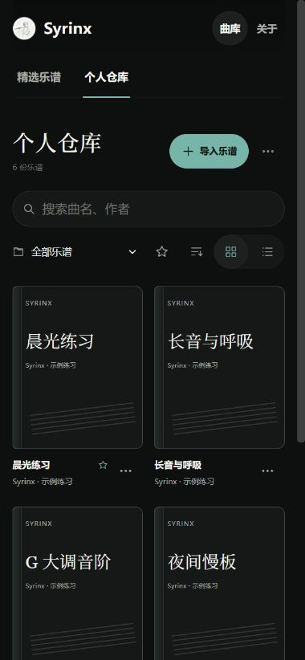

<div align="center">


# Syrinx · 长笛流光

**把喜欢的乐谱留在身边，让每一次练习从容开始。**

个人乐谱仓库 · 电子阅谱 · 长笛伴奏练习

[English](README.en.md) · [在线体验](https://romanticjojo.com) · [快速开始](#快速开始) · [版本说明](https://github.com/Romanticjojo/Syrinx/blob/dev/docs/releases/v0.3.0.md)


[](LICENSE)

</div>

> **从 `dev` 开始。** 本文介绍 `dev` 分支上的 v0.3.0 更新。GitHub 默认分支 `master` 同步说明文档；获取这里的功能，请使用下方带 `--branch dev` 的启动步骤。

<p align="center">
  
  <br /><sub>真实应用截图 · 个人仓库桌面视图 · 图中为项目原创示例练习</sub>
</p>

## 为日常练习，留一方自己的曲库

**收藏与整理。** 导入 MusicXML、XML 或 MXL，把曲名、作曲 / 编曲、标签和封面整理好。用文件夹、收藏与搜索找到下一首；卡片和列表都支持分页。

**翻开就能读。** 在电脑、平板和手机宽度下阅读乐谱、翻页与缩放。单长笛谱以电子阅谱方式打开，不生成音频；信息编辑保留导入的原始谱面。

**按自己的速度练。** 原谱含钢琴时，可选一个钢琴声部在本机合成伴奏，同一声部的左右手一起播放。跟随谱面光标演奏，调整 BPM、从指定小节起奏，再回听录音并查看音高对比。

## 选择适合你的版本

| | 正式版功能 · 本地运行 | 网页体验版 |
|---|---|---|
| 用途 | 收藏自己的乐谱，阅读与练习 | 快速体验精选曲目的演奏流程 |
| 个人仓库 | 导入、编辑信息、封面、文件夹、收藏、备份 | 入口标注「开发中」，点击后显示简短提示 |
| 曲目 | 自己导入的乐谱；精选曲目取决于本地素材 | 四首精选：Luv Letter、Flower Dance、Lumière、Interstellar |
| 运行入口 | `dev` · `npm run dev` | [在线体验](https://romanticjojo.com) · `npm run dev:web` |
| 版本对应 | `dev` → `v0.3.0` | `web-deploy` → `v0.3.0-web` |

当前通过浏览器运行。Windows、Android、macOS 和 iOS 原生安装包仍在规划中。在线站点运行已部署的版本，可能落后于分支更新；推送源码不会自动更新站点。

## 三步，开始自己的练习

### 1. 导入一份乐谱

本地启动后进入「个人仓库」，点击「导入乐谱」或拖入文件，确认名称与声部后保存。可以先试试仓库提供的两份原创小练习：

| 示例 | 内容 | 用法 |
|---|---|---|
| [晨光练习 · Morning Light](https://raw.githubusercontent.com/Romanticjojo/Syrinx/dev/docs/examples/morning-light.musicxml) | 长笛 + 一个双谱表钢琴声部 | 选择「钢琴伴奏」，阅读、试听并演奏 |
| [长音与呼吸 · Breath Study](https://raw.githubusercontent.com/Romanticjojo/Syrinx/dev/docs/examples/breath-study.musicxml) | 单长笛 | 直接保存为「仅阅谱」 |

将链接另存为 `.musicxml` 后导入；也可在克隆目录的 `docs/examples/` 中找到文件。[示例说明](docs/examples/README.md)

### 2. 整理成自己的书架

在乐谱菜单中编辑名称、作者、标签与 PNG / JPEG / WebP 封面；创建文件夹，批量移动乐谱，或收藏常练曲目。移除文件夹时，里面的乐谱会回到「未分类」。

<table>
  <tr>
    <td width="76%"></td>
    <td width="24%"></td>
  </tr>
  <tr>
    <td align="center"><sub>列表，适合快速查找</sub></td>
    <td align="center"><sub>窄屏，依然好翻阅</sub></td>
  </tr>
</table>

### 3. 翻开乐谱，开始练习

仅有旋律的乐谱可直接翻页阅读。带原谱钢琴声部的乐谱可先试听，再点「开始演奏」：四拍倒数后，伴奏与谱面光标一起前进。

首次进入演奏页会提示选小节与调整 BPM，关闭或开始演奏后不再自动提醒。点击谱面小节选择起点，或打开底部 BPM 控件慢练；选中框在该小节演奏完后消失。演奏中跳转小节或应用新速度，会先保留当前录音，再倒数四拍开始新段；就绪与暂停状态下操作会保持停止。

<p align="center">
  
  <br /><sub>真实应用截图 · 使用原创 Morning Light 乐谱调整练习速度</sub>
</p>

| 想做什么 | 操作 |
|---|---|
| 开始 / 暂停 / 继续 | 底部播放按钮，或空格键 |
| 从某个小节开始 | 点击谱面中的小节；播放中跳转会重新倒数 |
| 调整速度 | 点击 BPM，输入数值或拖动滑块，再点「应用速度」 |
| 回到谱面推荐速度 | 在速度面板点击「还原推荐」 |
| 录音与回听 | 打开录音；结束后选择录音分段、回放并对照伴奏 |
| 调整阅读大小 | 使用谱面的缩放按钮；个人阅谱器支持上一页 / 下一页 |

速度范围为初始谱面速度的 **0.5–1.5 倍**，原谱中的速度变化按比例保留。变速使用浏览器的原调保持能力；每段录音保留当时的速度，回放与音高分析对齐对应谱面区间。录音需允许麦克风访问；戴耳机可减少伴奏串入录音。

## 快速开始

需要 **Node.js 20.19+ 或 22.12+**，以及 npm。运行以下命令：

```bash
git clone --branch dev https://github.com/Romanticjojo/Syrinx.git
cd Syrinx/app
npm install
npm run dev
```

打开终端显示的本地地址，通常是 `http://localhost:5173`。此命令启用个人仓库；`desktop` 是当前的功能模式名称。

```bash
npm run dev:web        # 网页体验模式
npm run build          # 网页体验构建 → app/dist
npm run build:desktop  # 正式版功能构建 → app/dist-desktop
npm run preview        # 预览默认的 app/dist 构建
```

仓库包含四小节公开回退示例和上方两份可导入练习。精选曲目的私有谱面、伴奏、封面与视频不随源码分发，因此克隆结果与在线站点的精选曲库可能不同。

## 数据留在你的设备

个人仓库无需账号；导入解析、封面处理与原谱钢琴合成都在本机完成。乐谱、编辑信息、封面和文件夹保存在当前浏览器的 IndexedDB 中。

不同浏览器、用户配置或站点地址拥有各自的仓库；更换域名或本地端口不会自动迁移数据。清除站点数据会删除仓库。请从仓库菜单定期**导出备份**，迁移时再导入恢复；多卷备份需要逐卷保存与恢复。

本地运行时可离线阅读已导入乐谱并使用原谱钢琴伴奏，需保持本地应用服务可用。当前未提供网站离线缓存或云端同步。这里的「编辑」指乐谱信息编辑；伴奏使用原谱已有的一个钢琴声部，不提供音符编辑或自动编配。

## 架构与演奏数据流

Syrinx 是一个静态部署的浏览器应用。下面沿用 Archify 生成的图，展示精选曲目的核心链路；图中的引擎都运行在浏览器内。

### 核心架构


[交互图源](docs/img/syrinx-architecture-zh.html) · [结构化数据](docs/img/syrinx-architecture-zh.json)

### 从乐谱到练习反馈


[交互图源](docs/img/syrinx-dataflow-zh.html) · [结构化数据](docs/img/syrinx-dataflow-zh.json)

伴奏的实际播放位置驱动谱面光标。播放中跳转小节或变速，会保存当前录音并倒数开启新段；每段记录起点和速度，回听与图表按对应谱面时间对齐。录后音高分析交给后台 Worker，减少等待时的界面阻塞。个人仓库另外使用 IndexedDB 保存本地乐谱。

## 参与开发

Syrinx 使用 React、TypeScript、Vite、OpenSheetMusicDisplay、Web Audio 和 three.js。阅读与演奏在浏览器内完成；个人仓库与精选 Song Pack 是两条独立的曲目来源。

```bash
cd app                # 已在 app 目录时跳过
npm test              # 单元与组件测试
npm run lint          # 静态检查
npm run build
npm run build:desktop
```

- [v0.3.0 更新说明](https://github.com/Romanticjojo/Syrinx/blob/dev/docs/releases/v0.3.0.md) · [个人仓库范围](https://github.com/Romanticjojo/Syrinx/blob/dev/docs/superpowers/specs/2026-09-13-personal-library-scope-update.md)
- [速度与录音分段设计](https://github.com/Romanticjojo/Syrinx/blob/dev/docs/superpowers/specs/2026-09-13-tempo-feedback-design.md) · [网页部署](https://github.com/Romanticjojo/Syrinx/blob/dev/docs/DEPLOY-WEB.md)
- [提交问题或建议](https://github.com/Romanticjojo/Syrinx/issues) · [查看开发源码](https://github.com/Romanticjojo/Syrinx/tree/dev/app/src)

后续方向：原生安装包、小节循环练习，以及更多真实设备上的阅读与演奏体验验证。

## 致谢与许可

感谢 [OpenSheetMusicDisplay](https://github.com/opensheetmusicdisplay/opensheetmusicdisplay) 与 [three.js](https://github.com/mrdoob/three.js) 等开源项目。项目采用 [Apache License 2.0](LICENSE)；曲目媒体归各自权利人所有。
