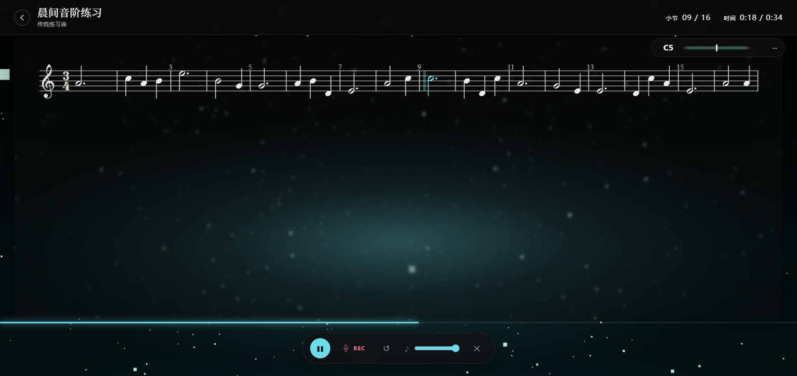
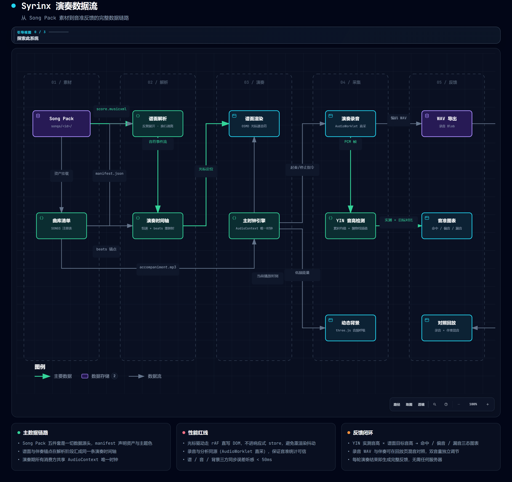
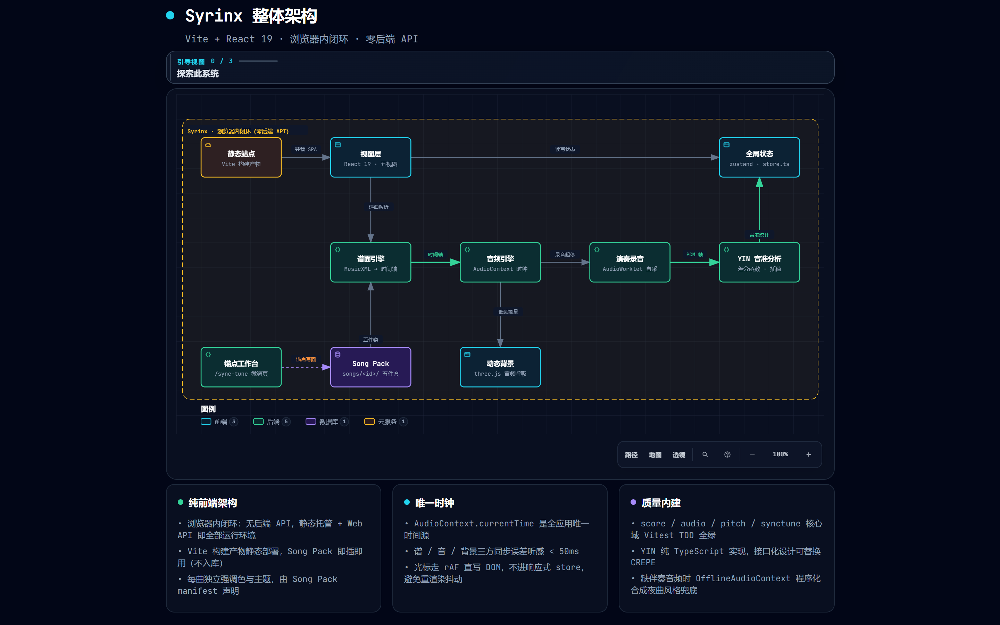

<div align="center">


# 🎶 Syrinx · 长笛流光

**吹响你的长笛，曲谱认得你的呼吸。**

[English](README.en.md) · [快速开始](#-快速开始) · [功能](#-功能总览) · [路线图](#-路线图) · [FAQ](#-faq--已知问题)


**智能乐谱** × **音乐游戏**

为真实长笛演奏而生的辅助应用

</div>

<p align="center">
  
</p>

## ✅ 功能总览

上面这一屏是打开 Syrinx 的第一眼：深色舞台上女神吹笛徽记与品牌字标，点击「进入应用」直达曲库。进入后的核心体验则是：顶部 HUD 实时显示小节与时间，谱面上光标逐音符跟随伴奏前进，three.js 动态背景随音乐呼吸，底部控制条把暂停 / 录音 / 缩放 / 退出收在一处。围绕这条演奏主线，各子系统能力如下：

| 状态 | 功能 |
|:---:|---|
| ✅ | MusicXML 曲谱渲染（OpenSheetMusicDisplay），光标逐音符跟随伴奏时间轴，自动滚动翻页 |
| ✅ | Web Audio 唯一主时钟：谱 / 音 / 背景三方同步，误差听感 <50ms |
| ✅ | 程序化伴奏合成：无伴奏音频时用 OfflineAudioContext 合成夜曲风格伴奏 |
| ✅ | 自研纯 TS **YIN 音高检测**（TDD），演奏结束生成音高对比曲线与音准统计（±50 音分） |
| ✅ | 演奏录音与回放，回放时可同时播放伴奏对照 |
| ✅ | three.js 动态沉浸背景，低频能量驱动光晕与粒子呼吸（audio-reactive） |
| ✅ | 3D 长笛模型入场动画 + 预览页展示，可跳过 |
| ✅ | 深浅双主题 + 每曲独立强调色（Song Pack 定义） |
| ✅ | Vitest 单元测试覆盖曲谱时间轴 / YIN / 音高统计 |
| ❌ | 移动端 / PWA（规划中） |
| ❌ | CREPE 深度学习音高检测增强（规划中） |
| ❌ | 循环小节练习、速度调节（规划中） |

## ✨ 亮点

功能表之下，是几个贯穿全项目的设计决策——它们决定了 Syrinx 在「实时演奏」这个场景下的工程性格：

> 🎼 **时间即谱面**
> `AudioContext.currentTime` 是唯一时间源 → rAF 每帧换算 → 直写 DOM 驱动光标，不进响应式 store，避免重渲染抖动。

> 🎹 **零素材也能伴奏**
> 没有 mp3 也能跑：按 MusicXML 音符事件程序化合成「旋律 + 低音 pad + 气声 + 混响」的夜曲风格伴奏。

> 🎤 **听得见你的音准**
> 自研 YIN 算法（差分函数 + 累积均值归一化 + 抛物线插值），纯 TypeScript 实现、TDD 全绿，接口化设计可替换为 CREPE。

> 🌌 **演奏也要有氛围**
> three.js 晨光主题场景随音乐呼吸，谱面区域受保护；3.2 秒无操作控件自动隐入，沉浸演奏。

## 🚀 快速开始

**环境要求**：Node.js **≥ 20.19**（或 ≥ 22.12，Vite 8 要求）；npm ≥ 10。

```bash
git clone https://github.com/Romanticjojo/Syrinx.git
cd Syrinx/app
npm install

npm run dev        # 启动开发服务器 → http://localhost:5173
npm run build      # 生产构建
npm run preview    # 预览生产构建
```

打开后：入场动画（可跳过）→ 曲库选曲 → 详情预览 → **开始演奏**：
4 拍倒数起奏 · 空格 暂停/继续 · ⏺ 录音开关 · 缩放 +/- · Esc 退出。

> ⚠️ **曲目素材不随仓库分发**：`app/public/songs/` 下的谱面 / 伴奏 / 封面（版权媒体）不包含在仓库中，克隆后曲库为空。请按下方 [Song Pack](#-曲目接入song-pack) 规格自行放入曲目，或放入一份任意 MusicXML 快速体验。

> 🎧 建议佩戴耳机演奏：伴奏外放会被麦克风录进演奏录音。

## 📁 项目结构

```
Syrinx/
├── app/                        # 前端工程（Vite + React + TS）
│   ├── public/
│   │   └── songs/              # 曲目素材（Song Pack，不入库）
│   ├── src/
│   │   ├── views/              # 四视图：Home / Preview / Perform / Result / SyncTune
│   │   ├── score/              # MusicXML → 时间轴解析（TDD）、OSMD 封装
│   │   ├── audio/              # 主时钟引擎、伴奏合成、录音、PCM/WAV
│   │   ├── pitch/              # YIN 音高检测、对比统计（TDD）
│   │   ├── synctune/           # 对 tune 模式逻辑与状态（TDD）
│   │   ├── background/         # three.js 主题场景、3D 长笛
│   │   ├── components/         # 谱面容器、控制条、音高图表、入场动画
│   │   └── store.ts            # zustand 全局状态
│   └── scripts/                # 渲染 / 截图 / 校验辅助脚本
├── docs/                       # 设计定稿、技术选型、截图
├── plans/                      # 实施计划
└── resources/                  # 素材源（本地私有，不入库）
```

## 🌊 演奏数据流

从 Song Pack 素材到音准反馈，一条链路看懂全应用（交互版见 [syrinx-dataflow-zh.html](docs/img/syrinx-dataflow-zh.html)，暗色主题可加 `?theme=dark`）：

<p align="center">
  
</p>

## 🏗️ 整体架构

纯前端 SPA，浏览器内闭环、零后端 API：静态站点装载 React 五视图，谱面 / 音频 / 录音 / 音准四大引擎与 Song Pack 素材层各就各位（交互版见 [syrinx-architecture-zh.html](docs/img/syrinx-architecture-zh.html)，暗色主题可加 `?theme=dark`）：

<p align="center">
  
</p>

## 🎵 曲目接入（Song Pack）

每首曲子一个素材包，放入 `app/public/songs/<song-id>/`：

```
app/public/songs/<song-id>/
├── manifest.json       # 元数据（见下）
├── score.musicxml      # 曲谱（MusicXML）
├── accompaniment.mp3   # 伴奏音频（可选，缺失则程序化合成）
├── background.mp4      # 动态背景视频（可选，缺失则 three.js 主题场景）
└── cover.jpg           # 封面（可选）
```

```jsonc
{
  "id": "my-song",
  "title": "My Song",
  "composer": "…",
  "difficulty": 2,                  // 1-3
  "durationLabel": "3:45",
  "keyLabel": "C 大调",
  "scoreUrl": "/songs/my-song/score.musicxml",
  "accompanimentUrl": "/songs/my-song/accompaniment.mp3",
  "accent": "#5fb8a8",              // 曲目主题色
  "backgroundTheme": "lumiere",
  "bpm": 90
}
```

图片谱可通过 OMR 管线转成 MusicXML 后按上述规格接入。

## 🗺 路线图

核心演奏闭环已经落地，接下来的重心是曲库生态与进阶练习功能：

| 阶段 | 内容 | 状态 |
|:---:|---|:---:|
| M1 | 预览 + 渲染：曲库 → 预览 → OSMD 谱面渲染 | ✅ |
| M2 | 同步演奏：时间轴 TDD、谱/音/光标同步、动态背景、沉浸控件 | ✅ |
| M3 | 录音 + 反馈：录音回放、YIN 音准检测、对比图表、3D 入场 | ✅ |
| P1 | 更多曲目 Song Pack、速度调节、循环小节 | 🚧 |
| P2 | CREPE 音高检测增强、混音回放 | 📅 |
| P3 | 多端（PWA / 移动端）、macOS / Linux 打包 | 📅 |

## ❓ FAQ / 已知问题

**Q：克隆后曲库是空的？**
A：正常——谱面 / 伴奏 / 封面属于版权媒体，不随仓库分发。按 [Song Pack](#-曲目接入song-pack) 规格放入 `app/public/songs/` 即可。

**Q：录音导出的 WAV 是静音？**
A：旧版本存在分析支路与录音支路不同源的问题，已改为 AudioWorklet 直采（与分析支路同源）。若仍遇静音，请检查系统麦克风权限与输入设备选择。

**Q：伴奏和光标对不齐？**
A：同步以 `AudioContext.currentTime` 为唯一时钟；若使用外部伴奏音频，请确保 manifest 中的节拍锚点（beats）与该音频对齐。

**已知问题**：① 入场 3D 动画在部分集显设备帧率偏低（可跳过）；② 曲库为空时首屏视觉较单薄（放一首歌即恢复）。

## 🤝 致谢

- [OpenSheetMusicDisplay](https://github.com/opensheetmusicdisplay/opensheetmusicdisplay) — 浏览器 MusicXML 曲谱渲染引擎
- [three.js](https://threejs.org/) — 3D 背景与长笛模型

> 谱面 / 伴奏 / 封面等曲目素材（版权媒体）不随仓库分发，各曲目版权归其权利人所有。

---

## 📄 License

本项目以 **Apache License 2.0** 开源发布，完整许可证文本见根目录 [LICENSE](LICENSE)。

Apache License 2.0 © 2026 Syrinx contributors——可自由使用、修改、分发（含商用），唯须保留版权与许可证声明；附带明确专利授权，衍生作品需显著标注修改。

<div align="center">
<sub>吹奏愉快 🎶 — S Y R I N X · 长笛流光</sub>
</div>
