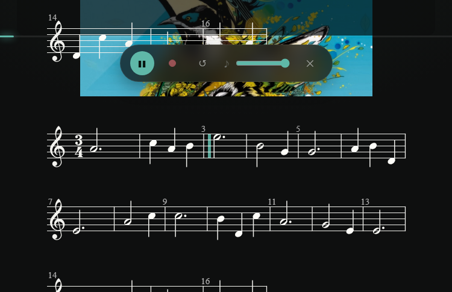

<div align="center">

# 🎶 Syrinx · 长笛流光

**吹响真实长笛，让曲谱跟随你流动。**

Syrinx（赛琳克斯）——希腊神话中化为排笛的仙女，德彪西同名长笛独奏曲。
这是一款**长笛演奏辅助应用**，介于「智能乐谱播放器」与「音乐节奏游戏」之间：

你吹奏真实的长笛，Syrinx 负责让光标跟着伴奏走谱、自动翻页、播放动态背景，
并录下你的演奏——回放时还能看到你的音准曲线。


**状态**：MVP 完成 · v0.1.0

</div>

---

## ✨ 核心特性

| | 特性 | 说明 |
|---|---|---|
| 🎼 | **曲谱跟随演奏** | OpenSheetMusicDisplay 渲染 MusicXML，光标逐音符跟随伴奏时间轴，自动滚动翻页 |
| ⏱ | **Web Audio 唯一主时钟** | `AudioContext.currentTime` 驱动一切，谱/音/背景三方同步，误差听感 <50ms |
| 🎹 | **程序化伴奏合成** | 无伴奏音频时，OfflineAudioContext 按音符事件合成夜曲风格伴奏（旋律+低音 pad+气声+混响） |
| 🎤 | **音准检测反馈** | 自研纯 TS **YIN 算法**（TDD），演奏结束生成音高对比曲线 + 音准统计（±50 音分） |
| 📼 | **演奏录音回放** | MediaRecorder 录制你的演奏，回放页可同时播放伴奏对照 |
| 🌌 | **动态沉浸背景** | three.js 晨光主题场景，低频能量驱动光晕与粒子呼吸（audio-reactive），谱面区域受保护 |
| 🧚 | **3D 长笛入场** | GLTF 长笛模型入场动画 + 预览页展示，可跳过（本地记忆） |
| 🎨 | **深浅双主题** | 设计 token 体系（A「夜航晨光」）：暖金 `#d9a441` + 晨光青 `#5fb8a8`，衬线标题 |
| 🎵 | **每曲独立主题** | 每首歌通过 Song Pack 定义强调色、封面、背景、伴奏，曲库 Netflix 式卡片流 |

## 📸 界面预览（真实运行截图）

| 曲库 · Netflix 式卡片流 | 曲目详情 · 预览 |
|---|---|
|  |  |

| 演奏 · 就绪倒数 | 演奏中 · 光标走谱 + 动态背景 |
|---|---|
|  |  |

## 🚀 快速开始

```bash
git clone <your-repo-url> syrinx
cd syrinx/app
npm install
npm run dev        # 开发服务器 → http://localhost:5173
npx vitest run     # 跑测试（TDD 全绿）
npm run build      # 生产构建
```

浏览器打开后：入场动画（可跳过）→ 曲库选曲 → 详情预览 → **开始演奏**：
4 拍倒数起奏，空格暂停/继续，⏺ 录音开关，Esc 退出。

> 🎧 建议佩戴耳机演奏：伴奏外放会被麦克风录进演奏录音。

## 🎮 功能导览

```
入场动画（3D 长笛 + 跳过）
   └─ 曲库（Netflix 卡片流 · 收藏）
        └─ 预览（封面 + 3D 长笛 + 伴奏试听 + 曲谱缩略 + 难度/调性/BPM）
             └─ 演奏（OSMD 曲谱 + 光标跟随 + 自动滚动 + 动态背景 + 录音 + 沉浸控件）
                  └─ 回放（录音回放 + 音高对比曲线 + 音准统计）
```

**演奏页交互**：4 拍倒数起奏 · 空格 暂停/继续 · ⏺ 录音开关 · 缩放 +/- · 伴奏音量 · 3.2 秒无操作控件自动隐入（沉浸模式）· `prefers-reduced-motion` 尊重。

## 🏗 技术架构

| 层 | 方案 | 要点 |
|---|---|---|
| 工程 | Vite 8 + TypeScript 6 + React 19 | zustand 5 四视图状态机（`home / preview / perform / result`） |
| 曲谱 | OpenSheetMusicDisplay 2.1 | MusicXML → SVG；时间驱动光标：`while (it.currentTimeStamp.RealValue * secPerQuarter <= t) cursor.next()` |
| 音频 | Web Audio API | 唯一主时钟；`AudioEngine` 单例：play/pause/seek/rate + AnalyserNode |
| 伴奏 | OfflineAudioContext 合成 / 外部音频 | manifest 提供 `accompanimentUrl` 优先，缺失则合成夜曲风格 |
| 录音 | MediaRecorder | webm/mp4，`echoCancellation:false` 保真 |
| 音高检测 | 自研 YIN（纯 TS，TDD） | 差分函数 + 累积均值归一化 + 抛物线插值；封装为接口，CREPE 可替换 |
| 背景 | three.js 0.185 | 粒子 + 光晕 + 深空渐变，低频能量驱动（audio-reactive），谱面区域保护 |
| 测试 | Vitest 4 + happy-dom | MusicXML 时间轴 / YIN / 音高对比统计，TDD 全绿 |

**同步模型**：`AudioContext.currentTime` 为唯一时间源 → rAF 每帧换算时间轴 → 直写 DOM（不进响应式 store，避免重渲染抖动）；store 只存低频状态（视图/曲目/演奏结果）。

## 🎨 设计系统 · A「夜航晨光」

三方向对比（A 夜航晨光 ★定稿 / B 声波暗流 / C 光影剧场）详见 [`docs/设计/`](docs/设计/)。

| Token | 值 | 用途 |
|---|---|---|
| `--bg` | `#0e0f0f` | 全局背景（暗色默认） |
| `--surface` / `--surface-2` | `#161818` / `#1e2020` | 层级面板 |
| `--ink` | `#f5f4f0` | 主文字 |
| `--accent` | `#5fb8a8` | 晨光青：全局唯一强调色（曲目层由 `--song-accent` 覆盖） |
| `--brand-gold` | `#d9a441` | 暖金：仅品牌位克制使用 |
| `--rec` | `#f3727f` | 录音状态 |
| 字体 | 衬线标题 + 无衬线 UI | 曲名诗意、控件紧凑 |

深浅双主题（`html[data-theme='light']`）+ localStorage 记忆，token 详见 [`app/src/index.css`](app/src/index.css) 与 [`docs/设计/style-tokens.md`](docs/设计/style-tokens.md)。

## 🎵 曲目接入（Song Pack）

每首曲子一个素材包，放入 `resources/<song-id>/`，按 `manifest.json` 归档到 `app/public/songs/<song-id>/`：

```
app/public/songs/<song-id>/
├── manifest.json       # 元数据（见下）
├── score.musicxml      # 曲谱（MusicXML）
├── accompaniment.mp3   # 伴奏音频（可选，缺失则程序化合成）
├── background.mp4      # 动态背景视频（可选，缺失则 three.js 主题场景）
└── cover.jpg           # 封面（可选）
```

```jsonc
{
  "id": "luv-letter",
  "title": "Luv Letter",
  "composer": "DJ OKAWARI",
  "difficulty": 3,                  // 1-3
  "durationLabel": "4:29",
  "keyLabel": "B 大调（转调）",
  "description": "…",
  "tags": ["钢琴", "节拍", "首发正式曲"],
  "scoreUrl": "/songs/luv-letter/score.musicxml",
  "accompanimentUrl": "/songs/luv-letter/accompaniment.mp3",
  "backgroundVideoUrl": "/songs/luv-letter/background.mp4",
  "coverUrl": "/songs/luv-letter/cover.jpg",
  "accent": "#5fb8a8",              // 曲目主题色
  "backgroundTheme": "lumiere",     // 背景主题
  "bpm": 90
}
```

**曲谱来源**：图片谱可通过 OMR 管线转为 MusicXML（Luv Letter 即由此接入，工作区见 `resources/luv-letter/score/omr-work/`，最终产物 `luv-letter-final.musicxml`）。

### 当前曲库

| 曲目 | 作曲家 | 难度 | 伴奏 | 背景 |
|---|---|---|---|---|
| **Luv Letter**（首发正式曲） | DJ OKAWARI | 🟡🟡🟡 演奏级 | 正式音频 | 动态视频 |
| Nocturne pour Lumière | Lorien Testard | 🟢🟢 进阶 | 程序化合成 | three.js 场景 |
| 晨间音阶练习 | 传统练习曲 | 🟢 入门 | 程序化合成 | three.js 场景 |

## 📁 项目结构

```
D:\Syrinx\
├── app\                前端工程（Vite + React + TS）
│   ├── src\
│   │   ├── views\      四视图：Home / Preview / Perform / Result
│   │   ├── score\      MusicXML → 时间轴（TDD）、OSMD 封装
│   │   ├── audio\      主时钟引擎、伴奏合成、录音
│   │   ├── pitch\      YIN 音高检测、对比统计（TDD）
│   │   ├── background\ three.js 主题场景、3D 长笛
│   │   └── components\ 谱面容器、控制条、音高图表、入场动画
│   └── public\songs\   曲目素材（Song Pack）
├── docs\               需求调研 / 技术选型 / 设计定稿
├── plans\              实施计划（superpowers 工作流）
└── resources\          素材源（模型 / 图片 / 曲目投放区）
```

## 🗺 路线图

- [x] **M1 预览 + 渲染**：曲库 → 预览 → OSMD 谱面渲染
- [x] **M2 同步演奏**：时间轴 TDD、谱/音/光标同步、动态背景、沉浸控件
- [x] **M3 录音 + 反馈**：录音回放、YIN 音准检测、对比图表、3D 入场
- [ ] **P1**：Luv Letter 正式曲谱替换（OMR 精修）、更多曲目 Song Pack、速度调节、循环小节
- [ ] **P2**：CREPE 音高检测增强、混音回放、多端（PWA/移动）

## 🤝 致谢

- [OpenSheetMusicDisplay](https://github.com/opensheetmusicdisplay/opensheetmusicdisplay) — 浏览器 MusicXML 曲谱引擎
- [three.js](https://threejs.org/) — 3D 背景与长笛模型
- [DJ OKAWARI](https://en.wikipedia.org/wiki/DJ_Okawari) — 《Luv Letter》首发正式曲
- Lorien Testard & Alice Duport-Percier — 《Clair Obscur: Expedition 33》OST
- [superpowers-zh](https://github.com/obra/superpowers) — 开发工作流框架

---

<div align="center">
<sub>吹奏愉快 🎶  —  S Y R I N X · 长笛流光</sub>
</div>
