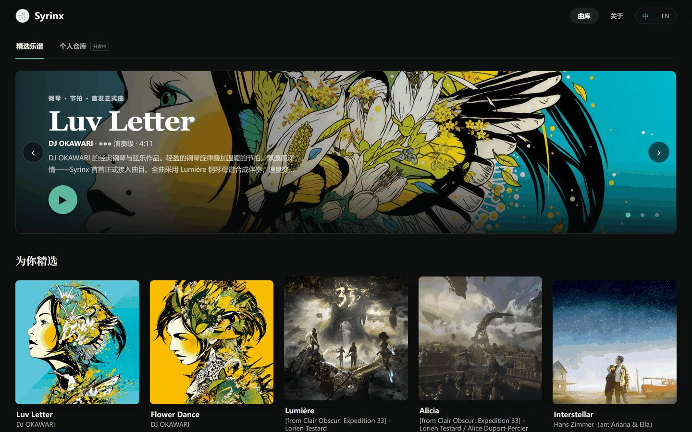
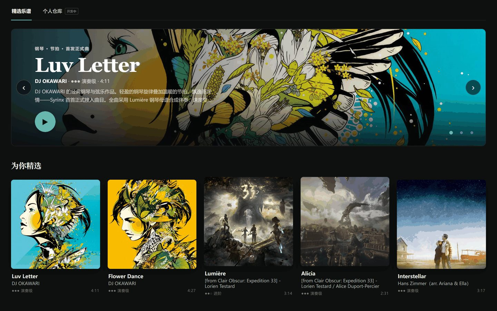
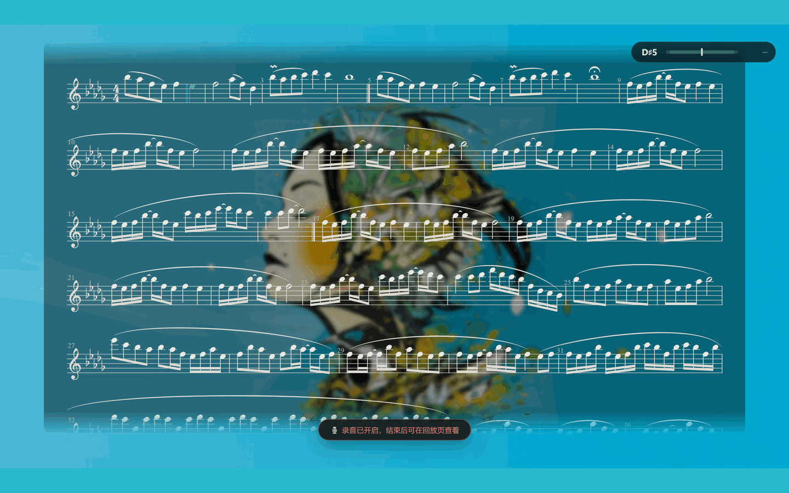
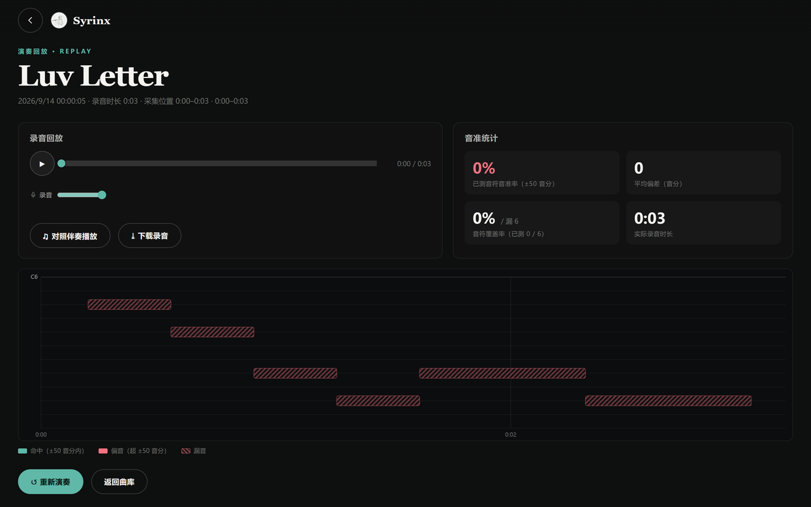
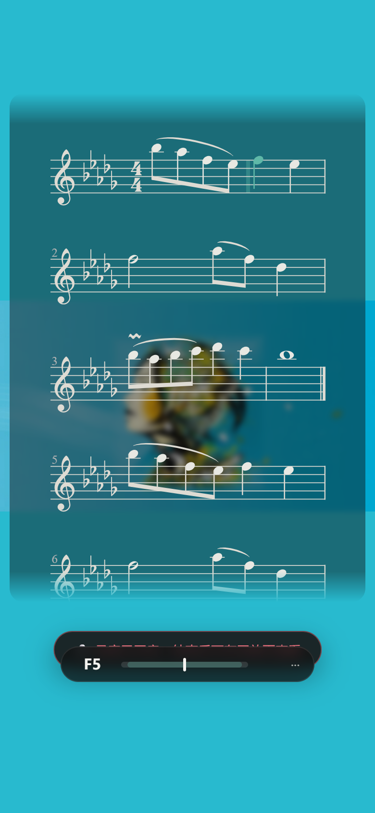

<div align="center">


# Syrinx · 长笛流光

**把喜欢的乐谱留在身边，让每一次练习从容开始。**

个人乐谱仓库 · 电子阅谱 · 长笛伴奏练习

[English](README.en.md) · [在线体验](https://romanticjojo.com) · [快速开始](#快速开始)


[](LICENSE)

</div>

## 下载与运行

**Windows 用户** —— 直接下载安装包，开箱即用：

> 📦 **[下载 Syrinx v0.3.0](https://github.com/Romanticjojo/Syrinx/releases/latest)** · `Syrinx-0.3.0-x64-setup.exe` 一键安装 · [Syrinx-0.3.0-portable.exe](https://github.com/Romanticjojo/Syrinx/releases/latest) 免安装版

安装包内置全部五首精选曲目（乐谱、采样钢琴伴奏、封面与动态背景视频），**安装后离线即用**。未签名安装包可能触发 SmartScreen 提示，选「更多信息 → 仍要运行」即可。

**其他平台 / 从源码运行** —— 见下方[快速开始](#快速开始)；也可先到 [romanticjojo.com](https://romanticjojo.com) 在线体验。

曲目素材的来源与版权说明见 [NOTICE.md](NOTICE.md)。

<p align="center">
  
  <br /><sub>精选曲库首页 · 英雄位轮播，悬停卡片即播放动态封面</sub>
</p>

## 它能做什么

**收藏与整理。** 导入 MusicXML、XML 或 MXL，把曲名、作曲 / 编曲、标签和封面整理好；文件夹、收藏、搜索、分页，卡片与列表两种视图。

**翻开就能读。** 桌面、平板、手机宽度下阅读乐谱、翻页与缩放。单长笛谱以电子阅谱方式打开，信息编辑保留导入的原始谱面。

**按自己的速度练。** 原谱含钢琴时，可选一个钢琴声部在本机合成伴奏。跟随谱面光标演奏，四拍倒数起奏、点小节定位、0.5–1.5 倍保调变速，演奏完回听录音并查看逐音音高对比。

**精选曲库开箱即用。** 五首钢琴伴奏曲目（Luv Letter、Flower Dance、Lumière、Alicia、Interstellar）随仓库与安装包分发：动态封面、循环背景视频、精确对齐的采样钢琴伴奏，无需导入任何文件。

## 精选曲目的沉浸式演奏

Hero 轮播 → 详情预览 → 起奏 → 录音回放与音准反馈，全流程无需账号。

### 曲库与详情

曲库卡片悬停时自动播放方形动态封面；进入曲目后，背景切换为与封面同源的高清循环视频，演奏页垫底色取自视频首帧，观感无缝衔接。

<table>
  <tr>
    <td width="50%"></td>
    <td width="50%"></td>
  </tr>
  <tr>
    <td align="center"><sub>曲库：悬停卡片即播放动态封面</sub></td>
    <td align="center"><sub>详情页：先读谱、试听，再开始演奏</sub></td>
  </tr>
</table>

### 演奏与实时反馈

点击「开始演奏」，四拍倒数后伴奏与谱面光标同步前进：

- **谱面光标** —— 沿伴奏实时位置前进，自动翻行居中；手动滚谱时自动让位
- **小节 HUD** —— 右上角实时显示当前小节与累计时间（如 `01 / 97`）
- **实时音高** —— 演奏中即时显示当前音准状态，偏离即刻可见

<p align="center">
  
  <br /><sub>演奏中的谱面：背景视频来自曲目封面，光标与伴奏逐音符对齐</sub>
</p>

### 录音回放与音准分析

演奏结束自动进入回放页，录音与伴奏可分别调节音量、对照回放。音高图上，高亮加粗轨迹是命中的音符、红色细轨迹是偏音、斜纹块是漏音；统计卡给出整段音准比例与平均音分偏差。分析在后台 Worker 中运行，长曲目也不卡界面。

<p align="center">
  
  <br /><sub>回放页：录音与伴奏双滑杆，音高图逐音对照谱面目标</sub>
</p>

### 手机端同样沉浸

同一套演奏流程，触屏自适应布局：悬浮音高条、行跟随谱面、背景视频与桌面端一致。

<p align="center">
  
</p>

## 快速开始

需要 **Node.js 20.19+ 或 22.12+** 与 npm：

```bash
git clone https://github.com/Romanticjojo/Syrinx.git
cd Syrinx/app
npm install
npm run dev          # 个人仓库模式（正式版功能）
```

打开终端显示的本地地址（通常是 `http://localhost:5173`）。其他命令：

```bash
npm run dev:web      # 精选曲库模式（安装包同款形态）
npm test             # 单元与组件测试
npm run build        # 构建 → app/dist
npm run dist         # 打包 Windows 安装包（electron-builder）
```

仓库自带全部精选曲目素材（`app/public/songs/`）与两份可导入的原创小练习（`docs/examples/`），克隆后开箱即用。

## 数据留在你的设备

个人仓库无需账号；导入解析、封面处理与钢琴合成都在本机完成，乐谱与编辑信息保存在当前浏览器的 IndexedDB 中。不同浏览器或站点地址的仓库相互独立，清除站点数据会删除仓库——请定期用仓库菜单的**导出备份**留存。

## 架构与演奏数据流

Syrinx 是静态部署的浏览器应用，谱面解析、时间轴、伴奏引擎与音高分析全部运行在浏览器内。

| 图 | 内容 |
|---|---|
| [核心架构](docs/img/syrinx-architecture-zh.png) | 视图、谱面、伴奏、录音与音高分析模块关系 |
| [演奏数据流](docs/img/syrinx-dataflow-zh.png) | 素材解析 → 时间轴 → 同步演奏 → 录音分段 → 音准反馈 |

伴奏的实际播放位置驱动谱面光标；跳转小节或变速会保存当前录音并倒数开启新段，每段记录起点和速度，回听与图表按对应谱面时间对齐。

## 参与开发

React 19 · TypeScript · Vite · OpenSheetMusicDisplay · Web Audio · three.js。个人仓库与精选 Song Pack 是两条独立的曲目来源。

```bash
cd app
npm test && npm run lint && npm run build
```

- [v0.3.0 更新说明](docs/releases/v0.3.0.md)
- [提交问题或建议](https://github.com/Romanticjojo/Syrinx/issues)

## 致谢与许可

感谢 [OpenSheetMusicDisplay](https://github.com/opensheetmusicdisplay/opensheetmusicdisplay) 与 [three.js](https://github.com/mrdoob/three.js) 等开源项目。程序代码采用 [Apache License 2.0](LICENSE)；曲目素材归各自权利人所有，见 [NOTICE.md](NOTICE.md)。
